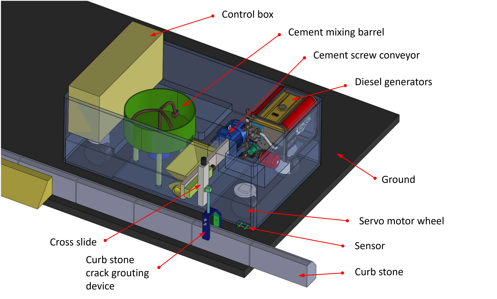
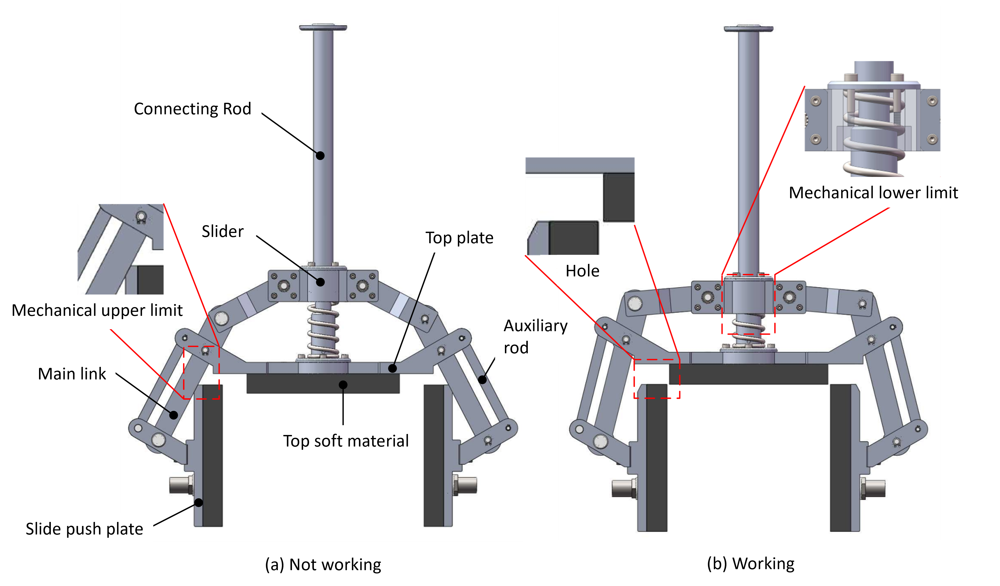
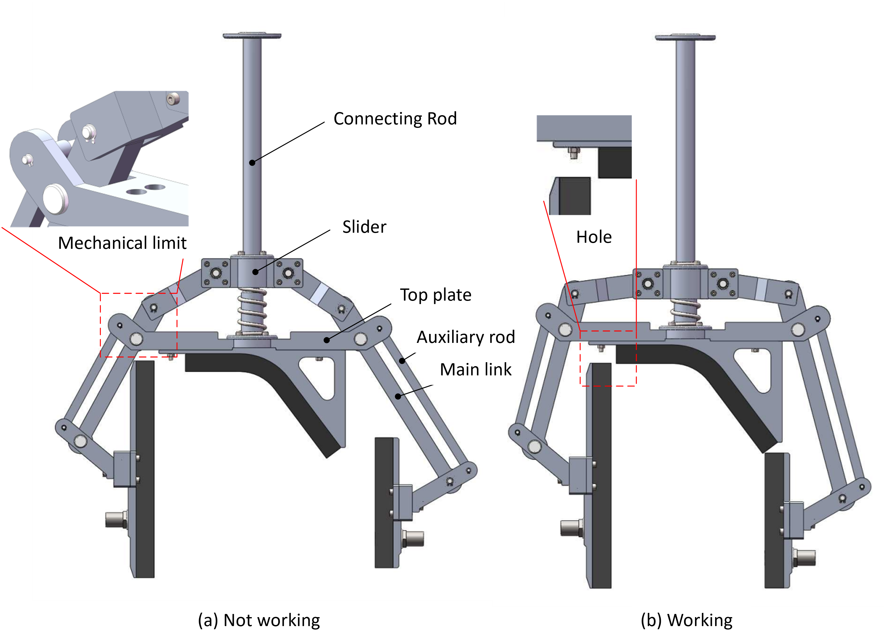

Date: 2022-05

The general structure of curb stone automatic filling machine:

A novel curb stone crack grouting device:

This project is in cooperation with Jinan University and Shandong Hi-speed Road & bridge Group Co., Ltd. 

Thanks to my supervisor [Fuxin Du](https://scholar.google.com/citations?user=uL2hW88AAAAJ&hl=en&oi=ao) and Aiqun Wang.
