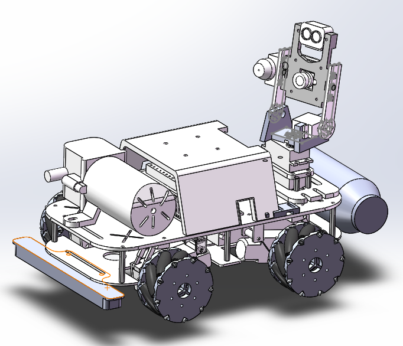
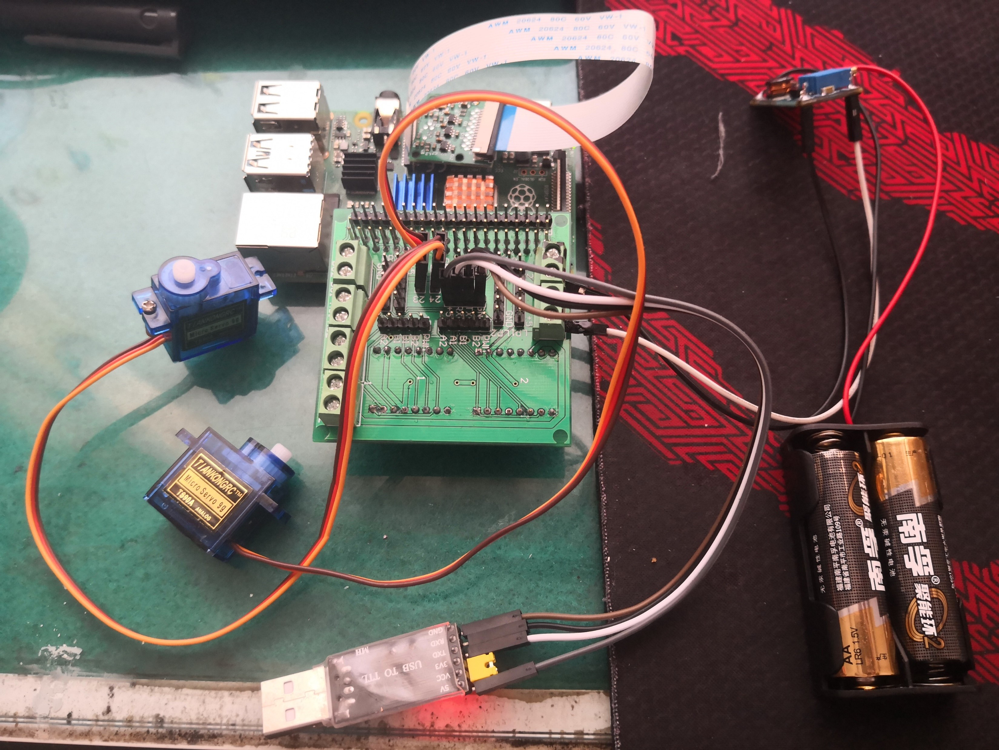

Date: 2020-05

An intelligent disinfection vehicle detects specific objects through a camera and disinfects them.

<iframe width="720" height="405" src="https://www.youtube.com/embed/XqJmm9nzymU?si=Nsu-f0JIc7YMKk-3" title="YouTube video player" frameborder="0" allow="accelerometer; autoplay; clipboard-write; encrypted-media; gyroscope; picture-in-picture; web-share" allowfullscreen></iframe>

Thanks to other team members, Yanjie Xu, etc.
