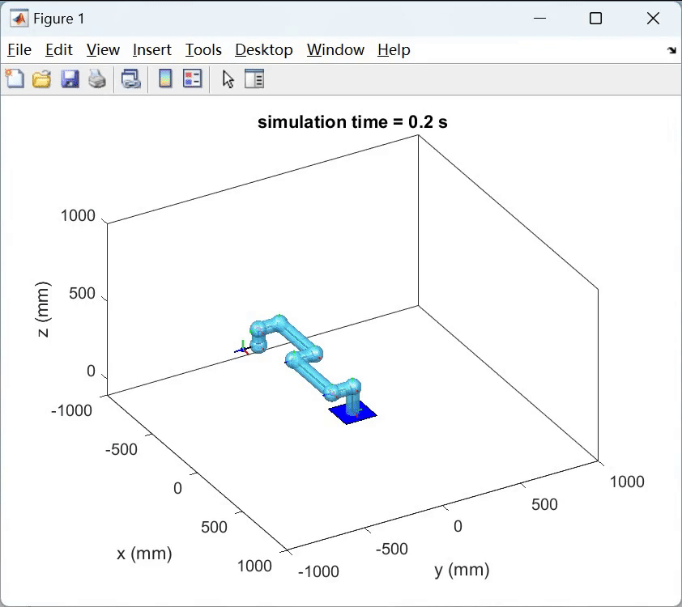

Date: 2023-03

The simulation process is shown, the word ‘FLOW’ can be written well. The whole process is to move to the starting point of a letter, start writing until the end point, move to the starting point of the next letter, until all are completed, and pause for 2s at the beginning and end of each letter.

For the details, we choose the front view of the word in above figure. All points are in the x-z plane, the dense part represents the acceleration and deceleration process, the sparse part represents the uniform velocity process.

Thanks to other team members, Wending Zhang and Qiong Wu.
