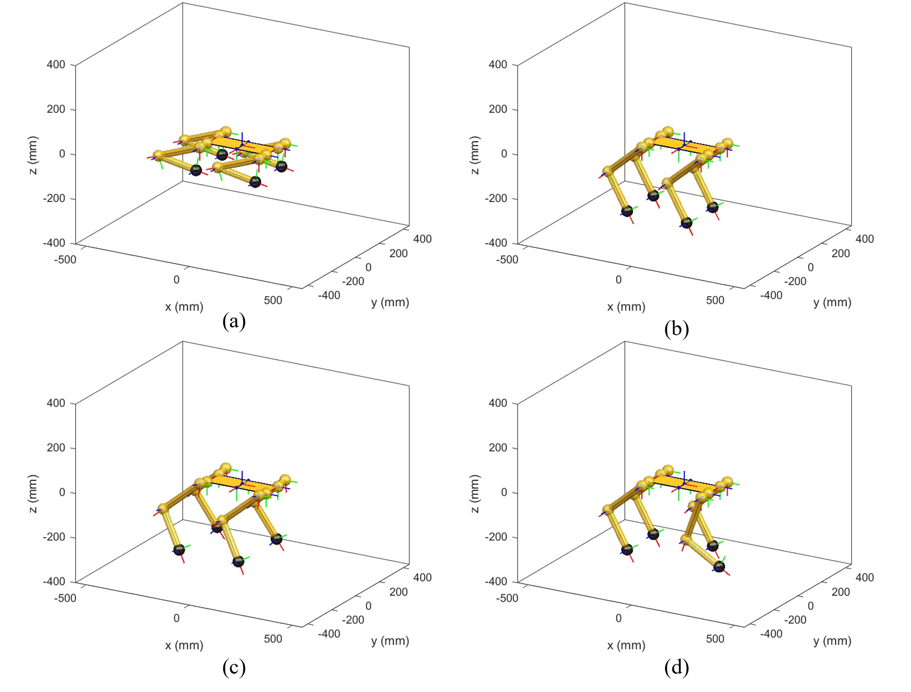
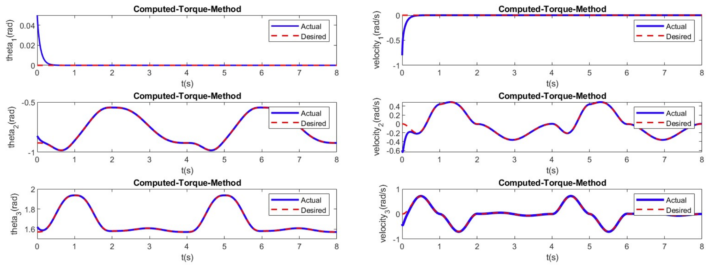
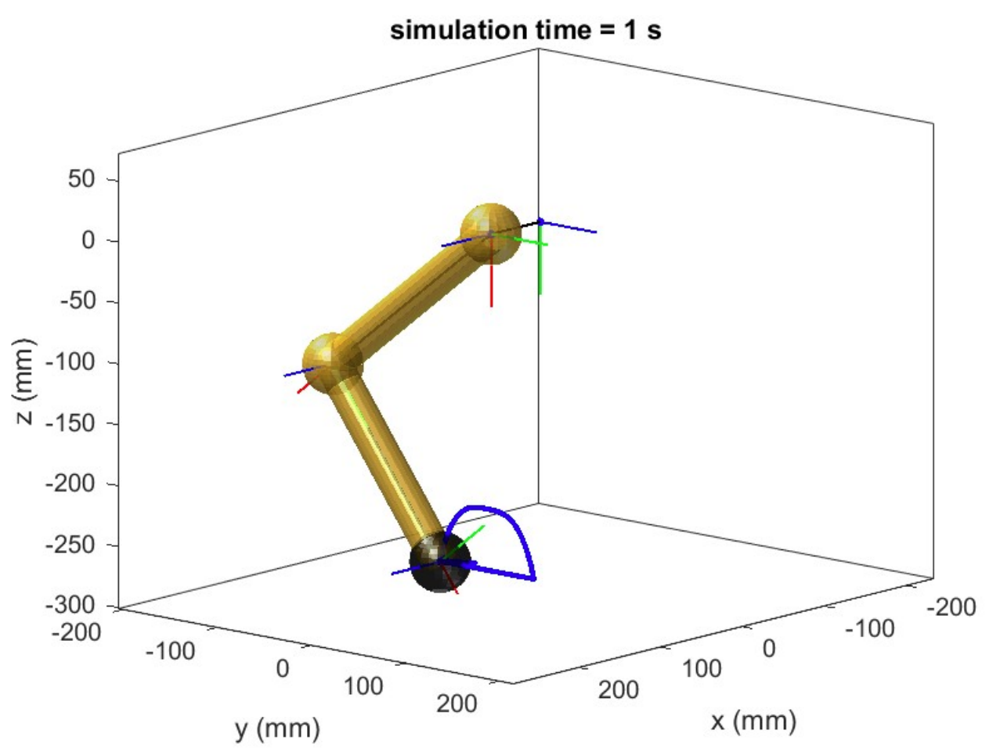
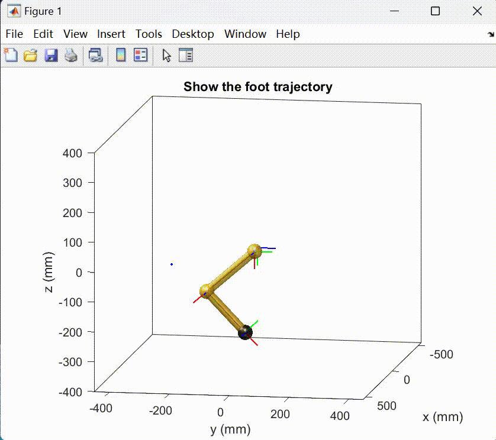

Date: 2023-05

 Following figures show the simulation model of a quadruped robot in different poses:

Position and velocity of each joint:

The final foot trajectory with computed torque method:

The final foot trajectory with PID method:

Thanks to other team members, [Lei Wu](https://www.linkedin.com/in/lei-wu-9b2901248/) and [Zifan Zhou](https://www.linkedin.com/in/zifan-zhou-500932288/).
