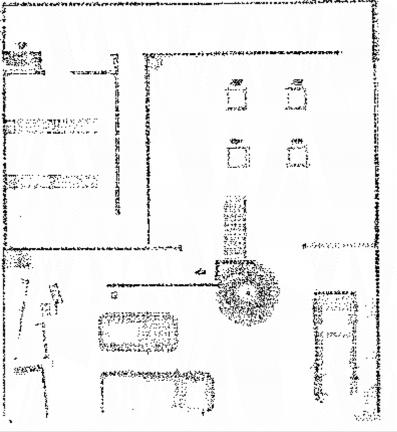
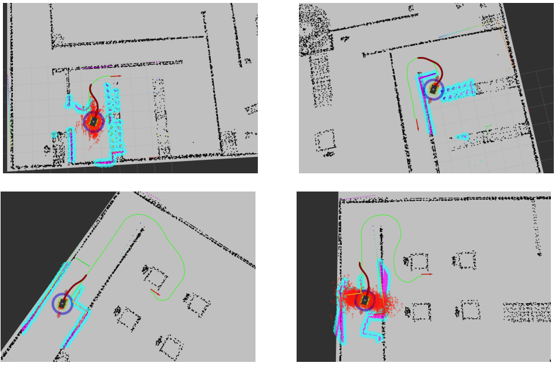

Date: 2023-04

The above results show that the map obtained after applying the filter retains the original information while removing the influence of ground noise, thus can be used for subsequent navigation work.

We put obstacles at gazebo randomly and observe the performance of navigation algorithm, some avoiding obstacle effects are shown as follows:

Thanks to other team members, [Zifan Zhou](https://www.linkedin.com/in/zifan-zhou-500932288/), [Ceng Zhang](https://www.linkedin.com/in/ceng-zhang-3854a3185/), and Wending Zhang.
