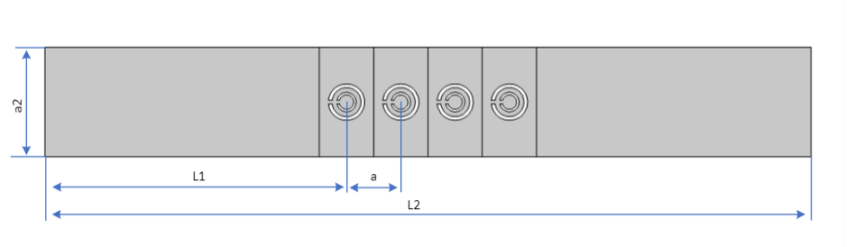
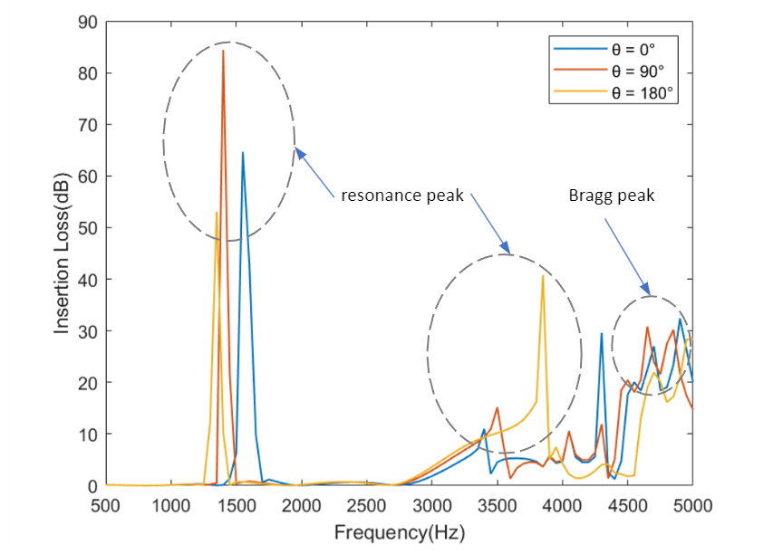
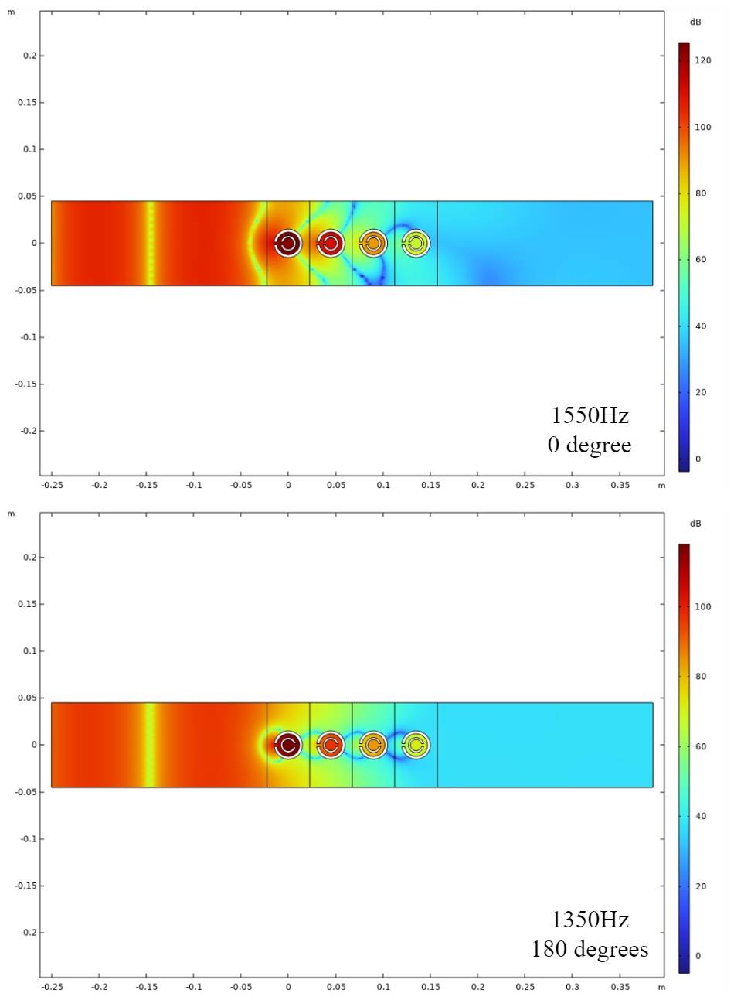
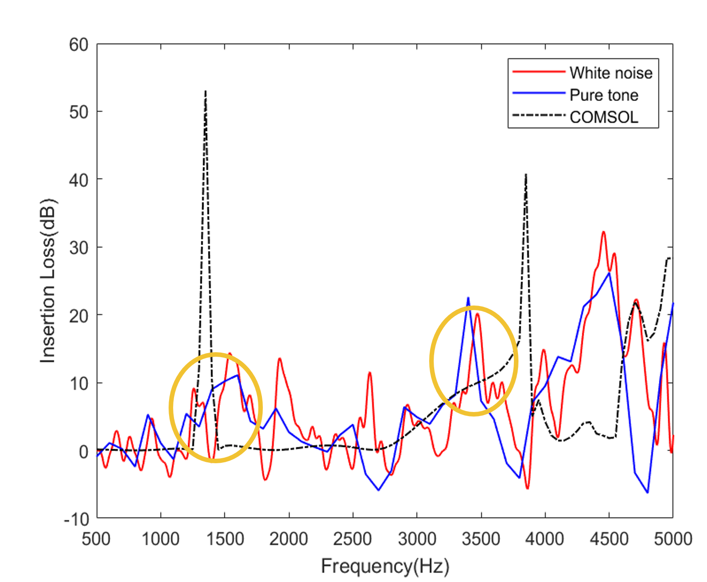

Date: 2022-10

Above figure shows our model of single channel with four units with corresponding design parameters. Simulations were done by COMSOL for 3 angles, θ = 0°, 90°, and 180°. Results were plotted as an IL-frequency graph as shown below.

Pressure distributions of single channel with 4 units for θ = 0° and 180° with 90mm channel width:

Comparison of 0 and 180 degree results of four units:

Thanks to other team members, Dingjin Qing, Ding Wang, [Tianting Zhang](https://www.linkedin.com/in/tianting-zhang-265a73205/).
