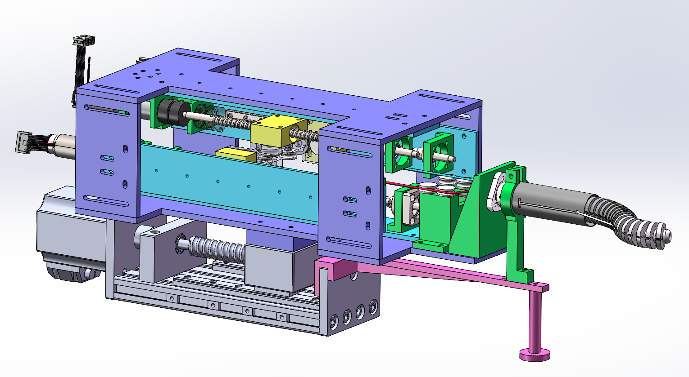

Date: 2020-02

Based on the variable stiffness continuum robot, designed a novel restricted continuum robot.

<iframe width="720" height="405" src="https://www.youtube.com/embed/rTXKFghl5MA?si=P3UIqMp3Vgy6H7LI" title="YouTube video player" frameborder="0" allow="accelerometer; autoplay; clipboard-write; encrypted-media; gyroscope; picture-in-picture; web-share" allowfullscreen></iframe>

Thanks to other team members, Gang Zhang, etc.
