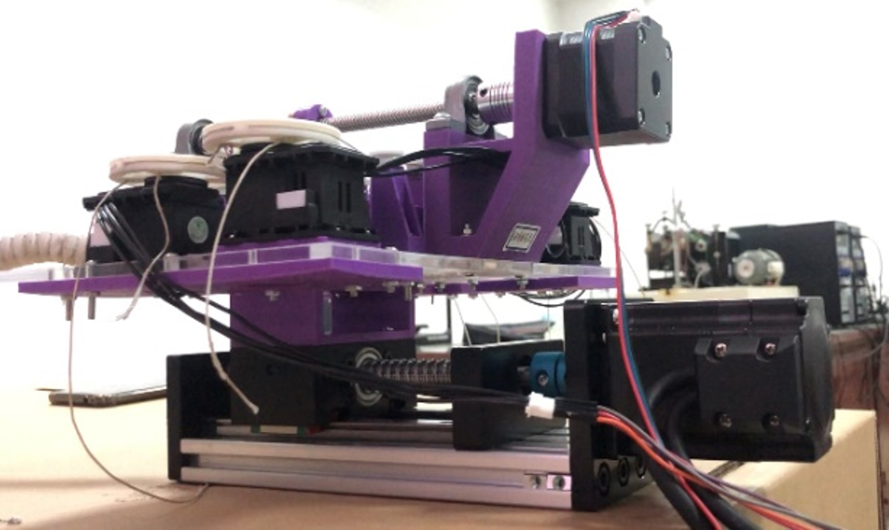

Date: 2019-08

Researched in continuum surgical robot, and worked on the method of variable stiffness of the continuum robot.

<iframe width="720" height="405" src="https://www.youtube.com/embed/YZrrG6nVa9E?si=pm1ZPbCWzOcOtESv" title="YouTube video player" frameborder="0" allow="accelerometer; autoplay; clipboard-write; encrypted-media; gyroscope; picture-in-picture; web-share" allowfullscreen></iframe>

Thanks to other team members, Gang Zhang, Hailin Sun, etc.
