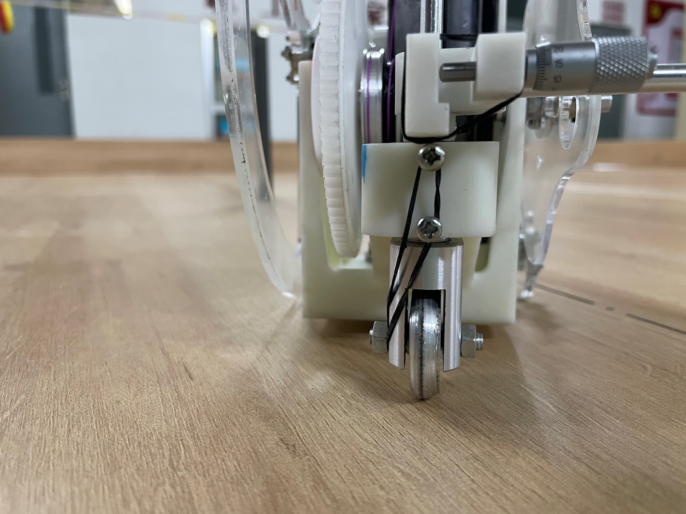
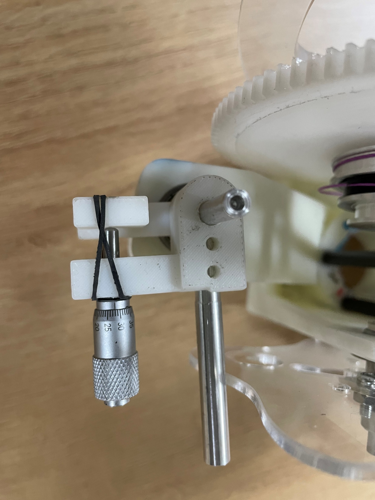

Date: 2021-3

Designed a carbon free car which moved in a O-S trajectory.

Our fine-tuning mechanism:

<iframe width="720" height="405" src="https://www.youtube.com/embed/qid9N-jwhNI?si=ZSRexLLsbgTzTRsT" title="YouTube video player" frameborder="0" allow="accelerometer; autoplay; clipboard-write; encrypted-media; gyroscope; picture-in-picture; web-share" allowfullscreen></iframe>

Thanks to other team members, Wenbo Ning, Yibo Liu and Longxue Guo.
