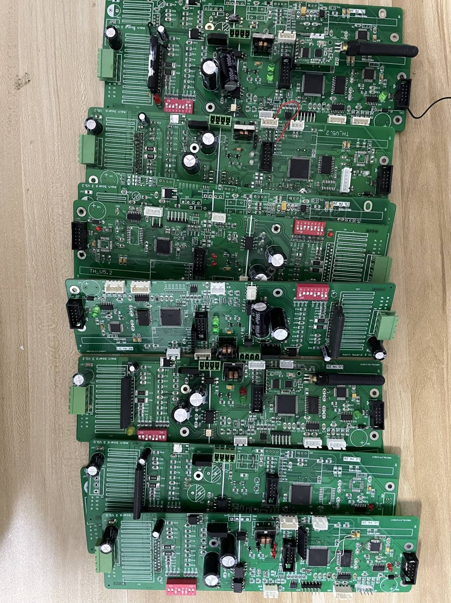
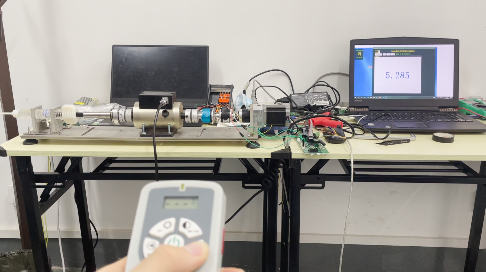

Date: 2021-08

Designed an upgraded controller board, updated control programs, and calibration device for the Remote-controlled injection manipulator.

Soldering, testing, debugging.

Calibrating the torque sensor.

<iframe width="720" height="405" src="https://www.youtube.com/embed/mHHF9BGkm94?si=GaCf-3nmAYl2Kp0o" title="YouTube video player" frameborder="0" allow="accelerometer; autoplay; clipboard-write; encrypted-media; gyroscope; picture-in-picture; web-share" allowfullscreen></iframe>

Thanks to other team member, Hailin Sun.
