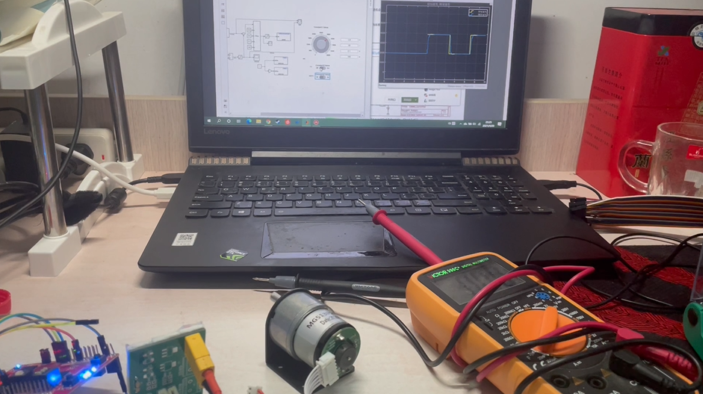

Date: 2021-4

Using Raspberry Pi as soft PLC combined with MATLAB to control the servo motor.

<!--  -->

<iframe width="720" height="405" src="https://www.youtube.com/embed/X1G_Mc1O-xw?si=va5loXIhnQXpx-gM" title="YouTube video player" frameborder="0" allow="accelerometer; autoplay; clipboard-write; encrypted-media; gyroscope; picture-in-picture; web-share" allowfullscreen></iframe>

Thanks to other team members, Wenbo Ning.
