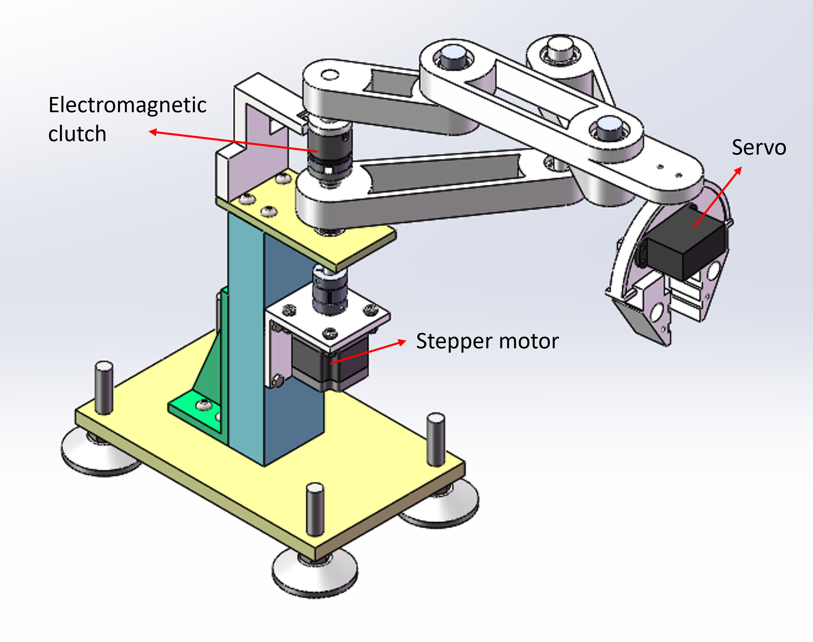

Date: 2020-06

Mechanical design, electronics design, and programming for an underactuated robot arm.

Model:

Control the end-effector with Xbox wireless controller:
<!--  -->

<iframe width="720" height="405" src="https://www.youtube.com/embed/WAs9RnRlDuQ?si=n1Jo5l7uD63v0yZm" title="YouTube video player" frameborder="0" allow="accelerometer; autoplay; clipboard-write; encrypted-media; gyroscope; picture-in-picture; web-share" allowfullscreen></iframe>

Thanks to other team members, Yanjie Xu, Yibo Liu, etc.
